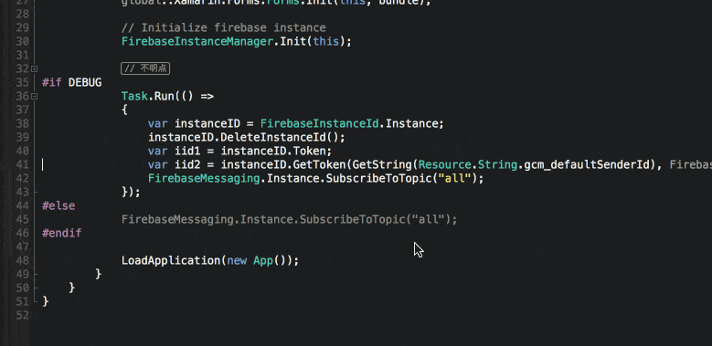

# VariableConsoleWriter

Xamarin Studioで選択した変数を
`System.Diagnostics.Debug.WriteLine`
しやすくするための拡張機能．

## 詳細
### インストール方法
https://github.com/yamachu/VariableConsoleWriter/releases にビルド済みdllが添付してあるため，最新版のVariableConsoleWriter.dllをダウンロードしてご利用ください．  

現在 MacOSX でのみの確認となっています．Macユーザであれば

`/Applications/Xamarin\ Studio.app/Contents/Resources/lib/monodevelop/AddIns`

にコピーすれば利用できます．

### 使い方
変数をドラッグし，右クリックからコンテキストメニューを表示すると
`Show Variable in Console`というコマンドが表示されるため，それをクリックするだけ．

## LICENSE
MIT
